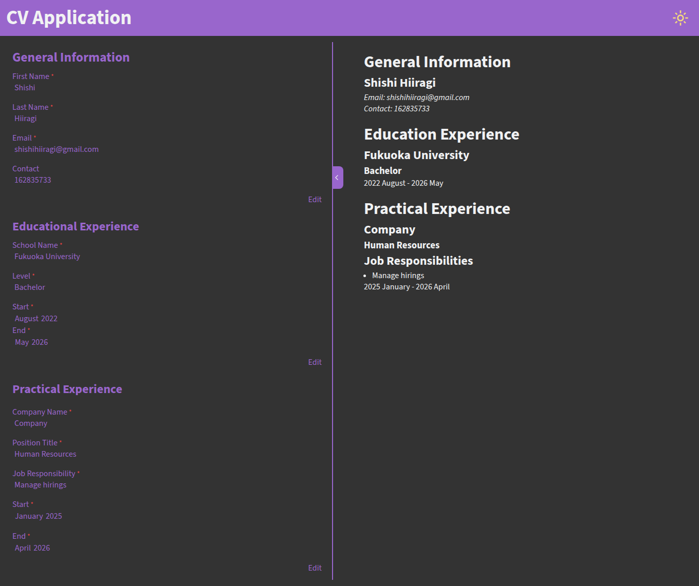

# CV Application

A simple cv builder that creates a cv based on form data.

## Screenshot:

## Features:

1. CV display when saving the form.
1. Form for General Information, Education, and Work experience.
1. Form validation.
1. Dark mode toggle.
1. Form hide/show toggle.

## What I learned:

1. How to utilize `useState` in react for state management.
1. Familiarize with react structure.
1. Using Vite for bundling.
1. How to make react components.

## Tools:

- HTML
- CSS
- Javascript
- React.js
- Vite
- Cloudflare

## How to run:

1. Clone the repository.
1. Run `npm install` in command line.
1. Run `npm run dev`.
1. Open the link in your browser.

## Future Improvements:

1. Create a feature that makes the displayed cv downloadable and printable.
